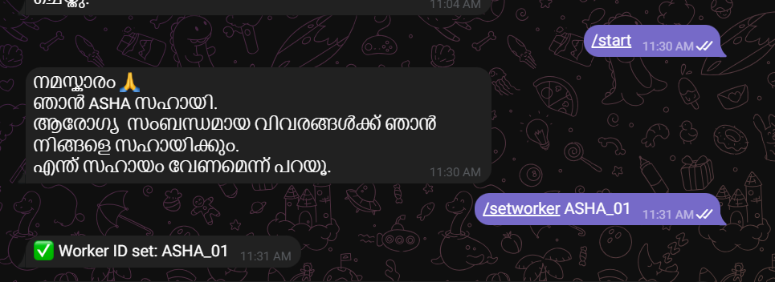
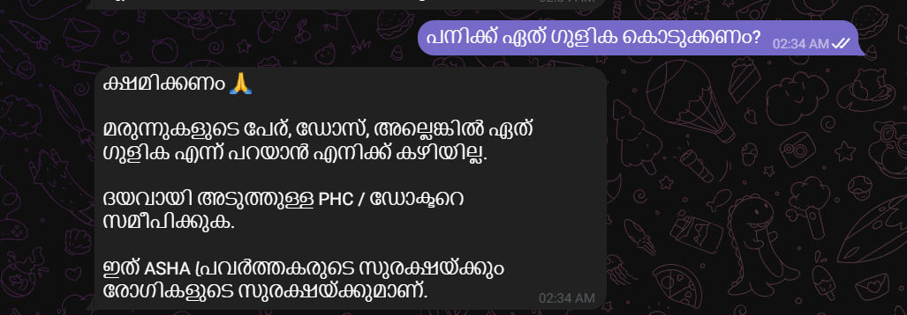
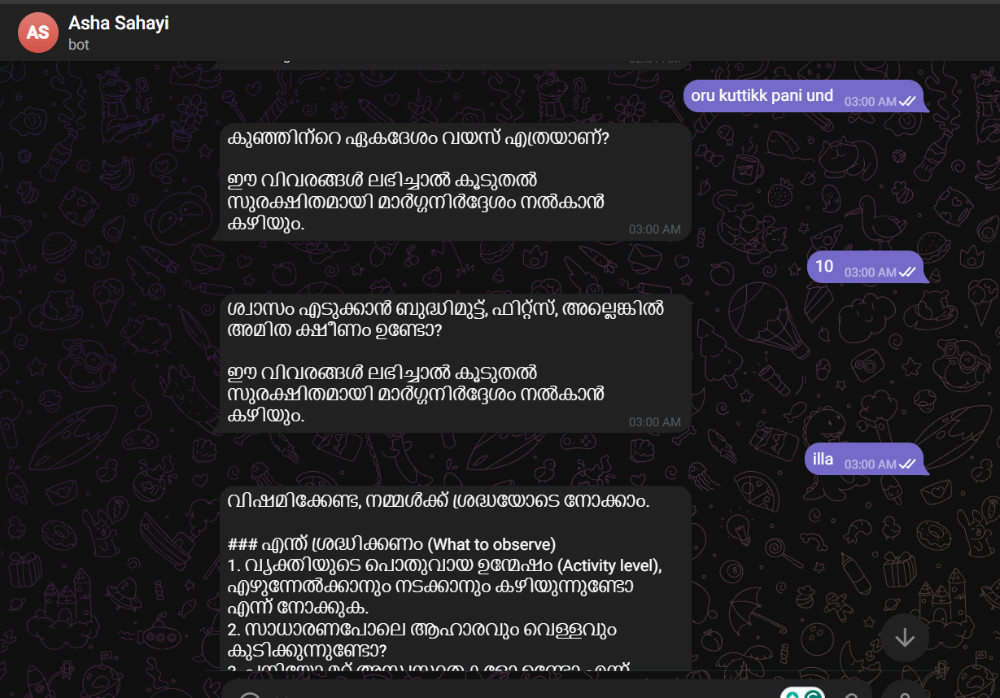
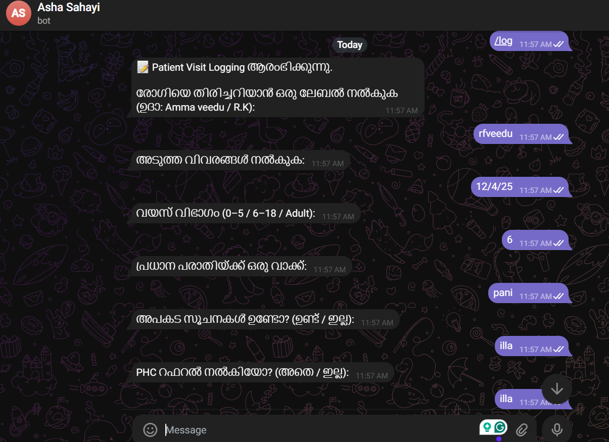
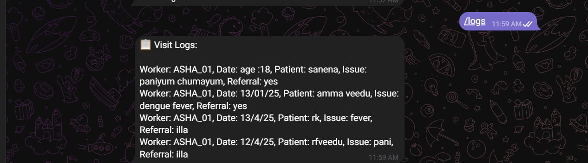

# ASHA Sahayi 🤖  
*A Telegram Bot to Support ASHA Frontline Health Workers*

ASHA Sahayi is a Telegram-based AI assistant designed to support **ASHA (Accredited Social Health Activist) workers** with safe, ethical, and context-aware health guidance and **patient visit logging**.

This project was developed as part of the internship selection task for the  
**UNESCO Chair on Gender Equality and Women’s Empowerment (AMMACHI Labs)**,  
**Amrita Vishwa Vidyapeetham**.

---

## 🎯 Problem Context

ASHA workers are frontline health workers who regularly conduct home visits and community outreach.  
During field work, they often need:

- Quick guidance on common symptoms  
- Help identifying **danger signs**  
- Clarity on **when to refer** patients to PHC or doctors  
- A simple way to **log patient visits digitally**

ASHA Sahayi is built as a **decision-support tool**, not a medical authority.

---

## ✨ Key Features

### 🤖 AI-Assisted Health Guidance
- Malayalam language support  
- Ask-before-advise workflow  
- Red-flag symptom checking  
- Referral-first guidance  
- Short, simple, ASHA-friendly responses  

### 🔐 Ethical & Safety Guardrails
- ❌ No diagnosis  
- ❌ No medicine names  
- ❌ No dosages  
- ❌ No treatment decisions  
- Explicit disclaimers and PHC referral advice  
- Medication-query safety filter  

### 📝 Patient Visit Logging (Day 5)
- SQLite-based local database  
- Worker ID–based accountability  
- Privacy-safe patient labels (no full names)  
- Structured visit logging  
- Log retrieval for recent visits  

### 👩‍⚕️ Worker-Centric Design
- `/setworker` to set ASHA worker ID  
- `/log` command for guided visit logging  
- `/logs` command to review recent entries  

---

## 🧠 Design Philosophy

- **Human-in-the-loop**: AI assists, ASHA workers decide  
- **Referral over reassurance**  
- **Ask-before-advise** to reduce hallucination  
- **Data minimization & privacy-by-design**  
- **Indian public health context (ICMR-aligned phrasing)**  
- Designed for **field conditions**, not clinical diagnosis  

---

## 🛠️ Tech Stack

- **Python**  
- **Telegram Bot API**  
- **python-telegram-bot**  
- **Google Gemini (google-genai SDK)**  
- **SQLite** (local database)  
- **python-dotenv** for secure key handling  

---

## ▶️ How to Run the Project

### 1️⃣ Clone the repository
```bash
git clone <your-github-repo-url>
cd asha-sahayi
````

---

### 2️⃣ Create and activate a virtual environment

**Windows (PowerShell):**

```powershell
python -m venv .venv
.venv\Scripts\activate
```

**Linux / macOS:**

```bash
python3 -m venv .venv
source .venv/bin/activate
```

---

### 3️⃣ Install dependencies

```bash
pip install -r requirements.txt
```

---

### 4️⃣ Create a `.env` file

Create a file named `.env` in the project root and add:

```env
TELEGRAM_BOT_TOKEN=your_telegram_bot_token
GEMINI_API_KEY=your_gemini_api_key
```

> ⚠️ `.env` is ignored via `.gitignore` and is not committed to GitHub.

---

### 5️⃣ Run the bot

```bash
python bot.py
```

If successful, you will see:

```
🤖 ASHA Sahayi bot with Gemini is running...
```

---

## 🧪 Supported Commands

```text
/start        → Start the bot
/setworker    → Set ASHA worker ID (required for logging)
/log          → Log a patient visit
/logs         → View recent visit logs
```

---

## 🧪 Sample Workflow (End-to-End)

### 1️⃣ Worker Setup

```text
/setworker ASHA_01
```

---

### 2️⃣ Ethical AI Health Guidance

**User:**

```
oru kuttikku pani und
```

**Bot:**

* Asks age
* Asks duration
* Asks danger signs
* Provides safe guidance
* Mentions red flags
* Advises PHC referral
* Includes disclaimer

✔ Ask-before-advise
✔ No diagnosis
✔ No medicines

---

### 3️⃣ Medication Safety Filter

**User:**

```
paracetamol ethra mg kodukkanam?
```

**Bot:**

* Refuses to give medicine or dosage
* Advises consulting PHC/doctor

✔ Ethical boundary enforced

---

### 4️⃣ Patient Visit Logging

**Command:**

```text
/log
```

Bot guides step-by-step:

* Patient label
* Visit date
* Age group
* Complaint
* Danger signs
* Referral
* Notes

Final response:

```
✅ സന്ദർശന വിവരങ്ങൾ സുരക്ഷിതമായി സേവ് ചെയ്തു.
```

---

### 5️⃣ View Logs

```text
/logs
```

Bot displays recent visits with:

* Worker ID
* Date
* Patient label
* Issue
* Referral status

---

## 📸 Demo & Proof of Work

The repository includes screenshots demonstrating:

* Ask-before-advise interaction
* Medication refusal (ethical filter)
* Malayalam guidance with red-flag checks
* Patient visit logging
* Log retrieval







---

## 🔐 Ethical AI & Data Privacy

* No medical diagnosis or prescriptions
* No medicine names or dosages
* No Aadhaar, phone numbers, or addresses
* Patient identification is optional and limited to local labels
* All data is stored locally using SQLite
* API keys are securely handled via environment variables

A detailed explanation is available in **`ethics.md`**.

---

## 🌱 Future Improvements

* Multi-language support (Tamil, Hindi)
* Structured visit summaries for supervisors
* Exportable visit reports
* Offline-first data capture
* Integration with public health dashboards

---

## 📜 License

This project is developed for academic and research purposes as part of an internship evaluation task.


---

